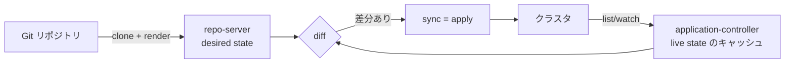

# ArgoCD とは

Kubernetes 向けの GitOps CD ツール。「Git に書かれた宣言(desired)とクラスタの実状態(live)を
比較し続け、差分があれば Git 側に収束させる」ことだけをやり続けるコントローラ群。

## GitOps という考え方

従来の push 型 CD(CI が kubectl apply を叩く)との対比で掴むのが早い。

| | push 型(CI が apply) | GitOps(pull 型) |
|---|---|---|
| 変更の起点 | CI パイプラインの実行 | Git のコミット |
| クラスタ認証情報 | CI に配る必要がある | クラスタ側(or hub)に閉じる |
| 手動変更(kubectl edit) | 次のデプロイまで残る | 検知され自動で巻き戻る |
| ロールバック | 再デプロイ手順 | git revert |
| 「今何が動いているか」 | CI ログを掘る | Git を見れば分かる |

核になる不変条件は **「Git が唯一の真実(single source of truth)」**。
クラスタへの変更手段を Git 経由に一本化することで、監査・再現・復旧が全部 Git の操作に還元される。

## 動作原理: reconcile ループ



- **desired**: Git のマニフェスト(kustomize / helm は render してから比較)
- **live**: クラスタの実リソース。watch でキャッシュし続ける
- 差分の扱いは syncPolicy で決める(次節)

## syncPolicy — このラボで体感する 3 点セット

```yaml
syncPolicy:
  automated:
    prune: true    # Git から消えたリソースは実クラスタからも削除
    selfHeal: true # 手動変更 (kubectl edit/scale) を検知して巻き戻す
  syncOptions:
    - ServerSideApply=true
    - CreateNamespace=true
```

この 3 つが有効だと運用は「**宣言 = 管轄**」になる:

- Git に書いたフィールドが書き換えられれば → 巻き戻る(selfHeal)
- Git からリソースを消せば → 実体も消える(prune)
- つまり変更・削除・ロールバックのすべてが Git 操作(PR と revert)に一本化される

## アーキテクチャ(コンポーネント)

| コンポーネント | 形 | 役割 |
|---|---|---|
| application-controller | StatefulSet | **本体**。diff と sync、health 評価。宛先クラスタのキャッシュを抱えるためメモリ大食い |
| repo-server | Deployment | Git を clone して render(kustomize/helm) |
| server | Deployment | Web UI と API(CLI の接続先) |
| applicationset-controller | Deployment | ApplicationSet から Application を量産する(生成だけ。sync はしない) |
| redis | Deployment | render 結果などのキャッシュ |
| dex / notifications-controller | Deployment | SSO / 通知(このラボでは無効化) |

## マルチクラスタ(hub-spoke)

1 つの ArgoCD(hub)が複数クラスタ(spoke)へデプロイできる。

- 宛先クラスタの登録は「`argocd.argoproj.io/secret-type: cluster` ラベル付き Secret」
  (名前・API サーバの URL・認証情報)。このラボでは `hub/clusters.yaml`(テンプレート)に
  `scripts/04-spokes.sh` が動的な値と秘密を埋めて apply している
- Application の `destination.name` がこの登録名を参照して解決される
- どの Application がどのクラスタ×namespace へ行けるかは AppProject が制限する([03-argocd-crds.md](03-argocd-crds.md))

なお hub / spoke は一般的なトポロジー用語(車輪のハブとスポーク)で、ArgoCD 公式の用語では
単に cluster / destination と呼ぶ。

## 守備範囲 — K8s 以外もデプロイできるのか

ArgoCD の destination は常に K8s クラスタで、sync の実体は K8s リソースの apply。
Cloud Run や Lambda のような非 K8s リソースへ**直接**はデプロイできない。

ただし「外部リソースを K8s のカスタムリソースとして表現するオペレータ」を挟むと管轄を広げられる:

```
ArgoCD ──sync──▶ K8s API 上の CR ──オペレータが reconcile──▶ 外部の実リソース
```

- Config Connector(GCP。例: `RunService` CR → 実 Cloud Run)
- Crossplane(マルチクラウド)/ ACK(AWS)
- ESO もこの同一パターン(ExternalSecret CR → 外部ストアの値)

正確に言えば「ArgoCD の管轄は *K8s API に置ける宣言* まで。宣言を外界に反映するのはオペレータの仕事」。

## このラボとの対応

| 概念 | ラボの実物 |
|---|---|
| ArgoCD 本体 | `hub/argocd/`(chart を kustomize で展開) |
| クラスタ登録 Secret | `hub/clusters.yaml`(テンプレート)に `scripts/04-spokes.sh` が値を埋めて apply |
| Application の量産 | `hub/applicationset.yaml` + マーカー |
| 手書き Application | `hub/platform.yaml`(gitea / vault を hub 自身 = in-cluster へ) |
| 区画(認可) | `hub/appproject.yaml`(demo)+ `hub/platform.yaml`(platform) |
| 宛先クラスタ側の権限 | `spoke/rbac.yaml` |

## 次に読むもの

- [03-argocd-crds.md](03-argocd-crds.md) — Application / AppProject / ApplicationSet の詳解
