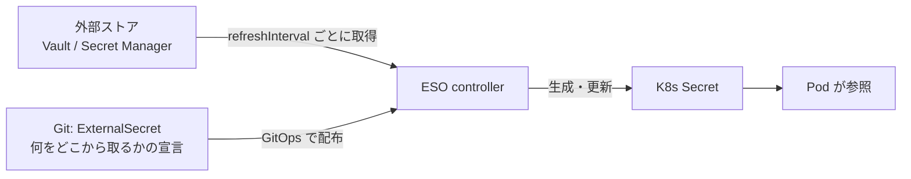

# ESO (External Secrets Operator) とは

## 解きたい問題: Secret は GitOps に素直に乗らない

GitOps は「すべてを Git に書く」が原則だが、Secret の値だけは Git に置けない
(平文コミットは論外、リポジトリ閲覧権限=秘密閲覧権限になってしまう)。主な解決策は 2 系統:

| 方式 | 代表 | 考え方 |
|---|---|---|
| 暗号化して Git に置く | Sealed Secrets, SOPS | 値そのものを暗号文にしてコミットする |
| **値は外部に置き、Git には参照だけ置く** | **ESO** | 外部シークレットストアを正本にする |

ESO は後者。クラウドのシークレット管理サービス(GCP Secret Manager / AWS Secrets Manager /
Vault など)を正本とし、**そこから値を取って K8s Secret を生成・更新し続けるオペレータ**。



Git に入るのは「宣言」だけ、値は外部ストアだけに存在する — GitOps の原則と秘密管理が両立する。

## CRD は実質 2 種類

**SecretStore / ClusterSecretStore** — 外部ストアへの「接続と認証」の定義。

```yaml
# このラボの seed-repo/app/secrets/overlay/dev/demo-secrets/secretstore.yaml
spec:
  provider:
    vault:
      server: http://demo-hub-control-plane:30201
      path: secret
      version: v2
      auth:
        tokenSecretRef: {name: vault-token, key: token}
```

- namespace スコープが SecretStore、クラスタ共通が ClusterSecretStore
- provider はストアの種類ごと(vault / gcpsm / aws / fake など多数)
- 認証はラボでは token(本番はクラウド IAM 連携にして秘密レスにするのが定石)

**ExternalSecret** — 「どのキーの値を、どの K8s Secret に写すか」の宣言。

```yaml
# 同 externalsecret.yaml
spec:
  refreshInterval: 15s          # この間隔で外部ストアを見に行き、変化を反映する
  secretStoreRef: {kind: SecretStore, name: vault}
  target:
    name: demo-app-secret       # 生成される K8s Secret 名
    creationPolicy: Owner       # ESO が Secret のオーナー (消えたら作り直す)
  data:
    - secretKey: message        # Secret 側のキー
      remoteRef:
        key: demo-app           # 外部ストア側のキー
        property: message
```

## 運用上の性質

- **ローテーションが「値の差し替えだけ」になる**: 外部ストアの値を更新すれば、
  refreshInterval 後に K8s Secret が追随する。マニフェストも Pod 定義も触らない
  (ラボでは `make rotate MSG=...` で体感できる)
- **ExternalSecret 自体は普通のマニフェスト**なので、ArgoCD で配れる。
  このラボでは 2 個目のマーカーアプリ(`make marker-secrets`)として配っている
- ArgoCD との相性で 1 つ既知の癖: ExternalSecret は CRD スキーマの既定値が live 側に
  補完されるため、ArgoCD の diff が**恒常 OutOfSync** と誤判定することがある。
  Application の annotation `argocd.argoproj.io/compare-options: ServerSideDiff=true`
  (diff の予測を kube-apiserver の dry-run に任せる)で解消する

## ラボでの一連の流れ

```bash
# Vault(外部ストア) + ESO + 認証 token は make up で導入済み (単体再実行: make eso-up)
# なお Vault 自体も手書き Application `vault` (hub/platform.yaml) として GitOps 管理されている
make marker-secrets  # ExternalSecret を GitOps で配布
kubectl --context kind-demo-dev -n demo-app get secret demo-app-secret \
  -o jsonpath='{.data.message}' | base64 -d
make rotate MSG=v2   # 正本を更新 → 15 秒後に Secret が追随
```

このとき Git のどこにも `s3cr3t...` という値が現れていないことを確認すると、ESO の存在意義が腹落ちする。
